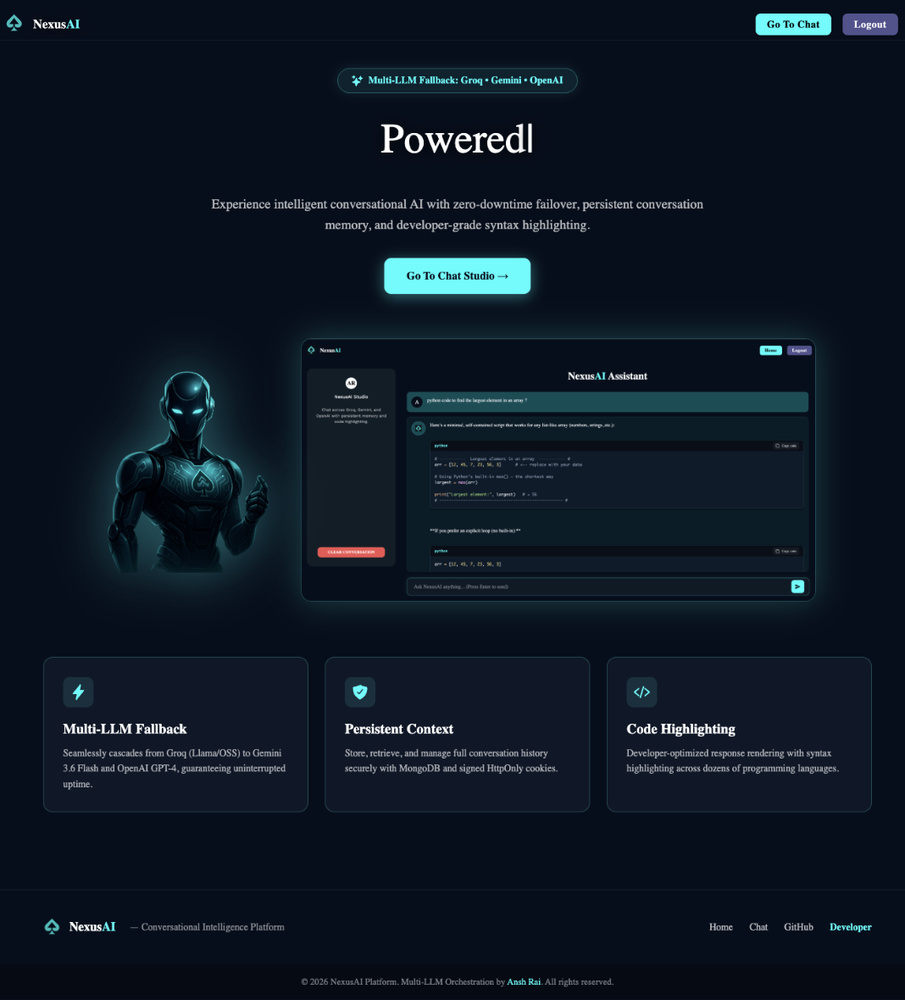
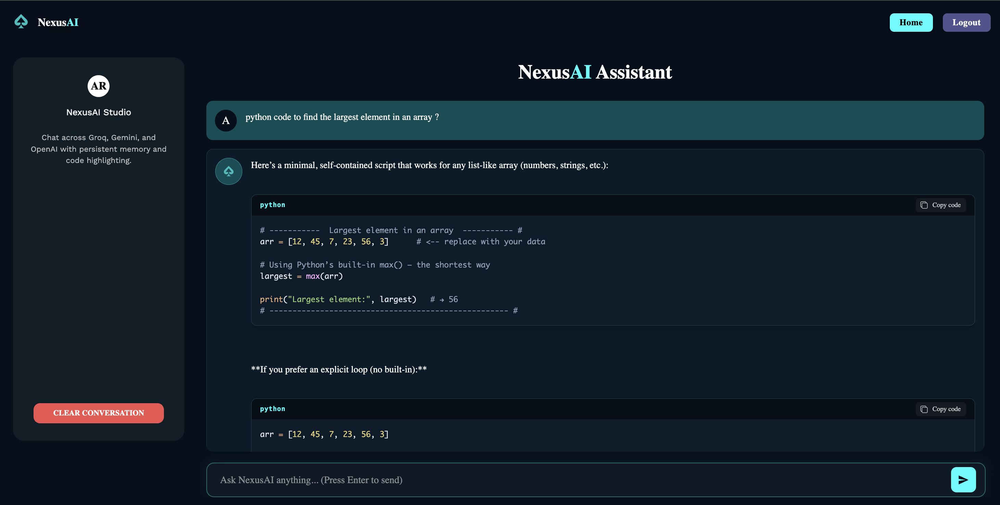

# NexusAI - Intelligent Conversational AI Platform

<p align="center">
  
</p>

NexusAI is a full-stack, state-of-the-art conversational AI platform built with the MERN stack (MongoDB, Express, React, Node.js) and TypeScript. It features a resilient **Multi-LLM Fallback Architecture** that seamlessly routes chat completions across **Groq (Llama 3.3 70B)**, **Google Gemini (Gemini 1.5 Flash)**, and **OpenAI (GPT-3.5 / GPT-4)**.

**Live Demo:** [NexusAI](https://nexusai-r5ww.onrender.com)

---

## Screenshots

### User Experience


### Chat Studio & Syntax Highlighting


---

## Key Features

- **Multi-LLM Fallback Engine**: Automatic failover across Groq, Google Gemini, and OpenAI to ensure 99.9% uptime and prevent vendor rate-limiting disruptions.
- **Persistent Chat History**: Fast MongoDB-backed conversation storage per user with full markdown and syntax-highlighted code blocks.
- **One-Click Code Copy**: Developer-first syntax highlighter with instant copy-to-clipboard buttons and feedback.
- **Secure Authentication**: Cookie-based JWT sessions with signed HTTP-only cookies and bcrypt password hashing.
- **Modern Responsive UI**: Premium cyberpunk-styled interface crafted with React, Material-UI, and smooth micro-animations.
- **Smart Session Recovery**: Clean 200 OK guest state handling for seamless client-side authentication checks.

---

## Multi-LLM Architecture

```
User Prompt ──► [Express API Layer] ──► [Token Auth & Validation]
                                              │
                                              ▼
                             [Multi-Provider Fallback Chain]
                                              │
              ┌───────────────────────────────┼───────────────────────────────┐
              ▼                               ▼                               ▼
       [Primary: Groq]             [Secondary: Gemini]             [Tertiary: OpenAI]
    (Llama 3.3 70B / 8B)            (Gemini 1.5 Flash)             (GPT-3.5 / GPT-4)
```

---

## Tech Stack

### Frontend
- **React 19** with **TypeScript** & **Vite**
- **Material-UI (MUI)** & Custom CSS Design System
- **React Router v7**
- **React Syntax Highlighter** (Prism theme with custom styling)
- **React Hot Toast** (custom notifications)
- **Axios** (configured for cross-origin credentials)

### Backend
- **Node.js** & **Express 5** (TypeScript)
- **MongoDB** with **Mongoose ODM**
- **OpenAI SDK v4** (OpenAI-compatible multi-provider routing)
- **JSON Web Tokens (JWT)** & **cookie-parser**
- **express-validator** & **bcrypt**

---

## Setup & Installation

### Prerequisites
- Node.js (v18 or higher)
- MongoDB Atlas cluster or local MongoDB instance
- At least one API key from [Groq](https://console.groq.com), [Google AI Studio](https://aistudio.google.com), or [OpenAI](https://platform.openai.com)

---

### 1. Clone the Repository

```bash
git clone https://github.com/Anshr23/NexusAI.git
cd NexusAI
```

---

### 2. Backend Configuration & Startup

```bash
cd backend
npm install
```

Create a `.env` file in the `backend/` directory:

```env
PORT=5001
NODE_ENV=development
MONGODB_URL=your_mongodb_connection_string
JWT_SECRET=your_super_secret_jwt_key
COOKIE_NAME=auth_token
COOKIE_SECRET=your_cookie_signature_secret
FRONTEND_URL=http://localhost:5173

# AI Providers (add one or all for automatic fallback)
GROQ_API_KEY=your_groq_api_key
GEMINI_API_KEY=your_google_gemini_api_key
OPEN_AI_SECRET=your_openai_api_key
```

Run the backend server:

```bash
npm run dev
```

---

### 3. Frontend Configuration & Startup

In a new terminal:

```bash
cd frontend
npm install
npm run dev
```

The application will start at `http://localhost:5173`.

---

## API Endpoints

### User Routes (`/api/v1/user`)
- `POST /signup` — Register a new user account
- `POST /login` — Authenticate and issue signed session cookie
- `GET /auth-status` — Verify active session (returns 200 OK with `isAuthenticated`)
- `GET /logout` — Invalidate session and clear auth cookie

### Chat Routes (`/api/v1/chat`)
- `POST /new` — Send message and receive AI completion (with multi-provider fallback)
- `GET /all-chats` — Retrieve conversation history for current user
- `DELETE /delete` — Clear all chat messages for current user

---

## License

Distributed under the ISC License.
